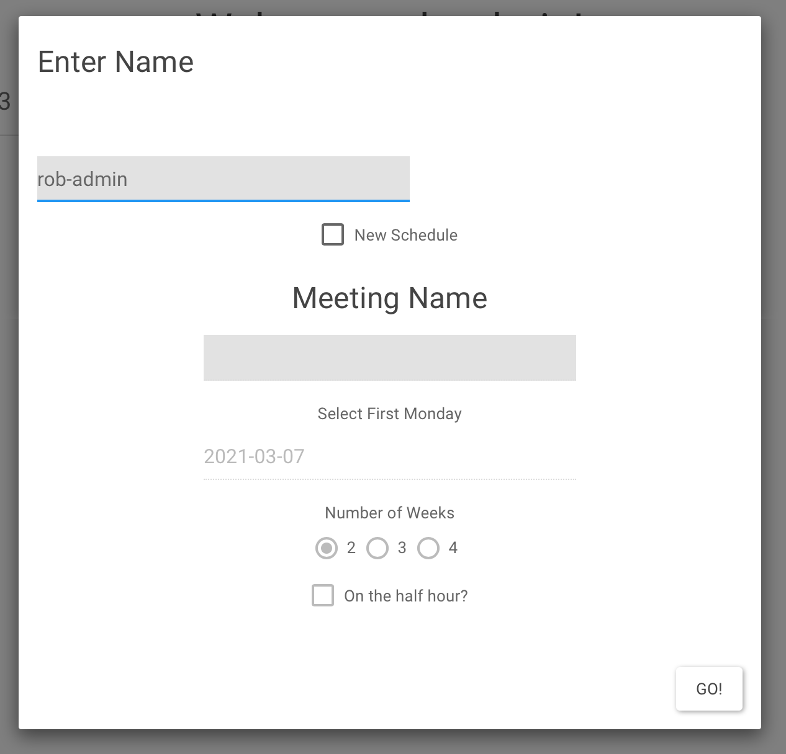
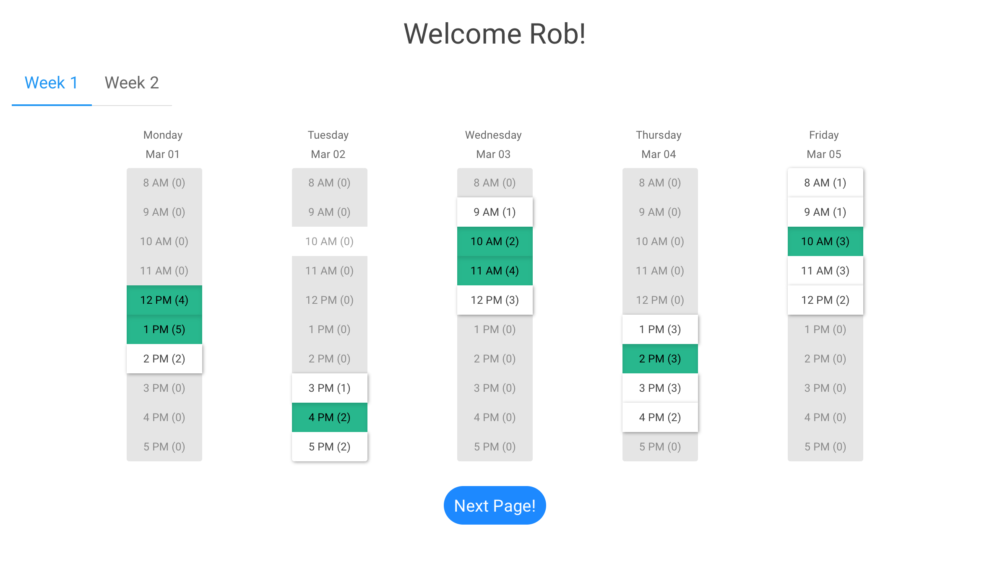
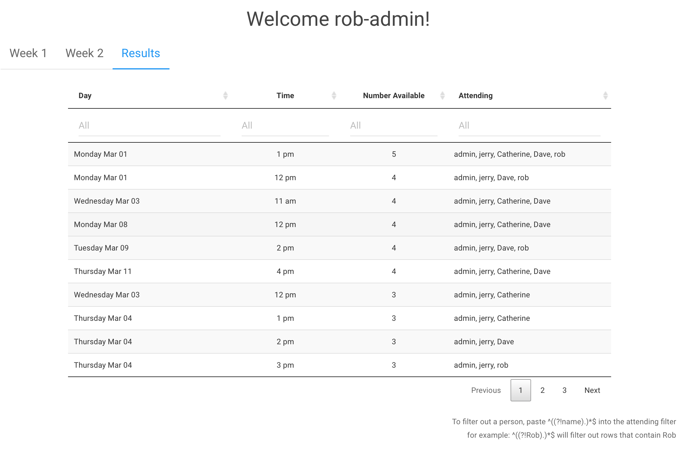

<!-- README.md is generated from README.Rmd. Please edit that file -->

```{r, include = FALSE}
knitr::opts_chunk$set(
  collapse = TRUE,
  comment = "#>"
)
```

# meetR

<!-- badges: start -->

<!-- badges: end -->

A simple shiny app for finding shared meeting times because I'm sick of using doodle pools and all their ad garbage.

1.  Run the app locally after setting up google sheets (see link.R file for instructions)
2.  Publish your own version to shinyapps.io
3.  ...profit?



Publish the app. Send link to the meeting people. They fill out the app.



After everyone response, you see results and pick a time to meet. You don't deal with ads. Now you deal with a sluggish shiny app.


