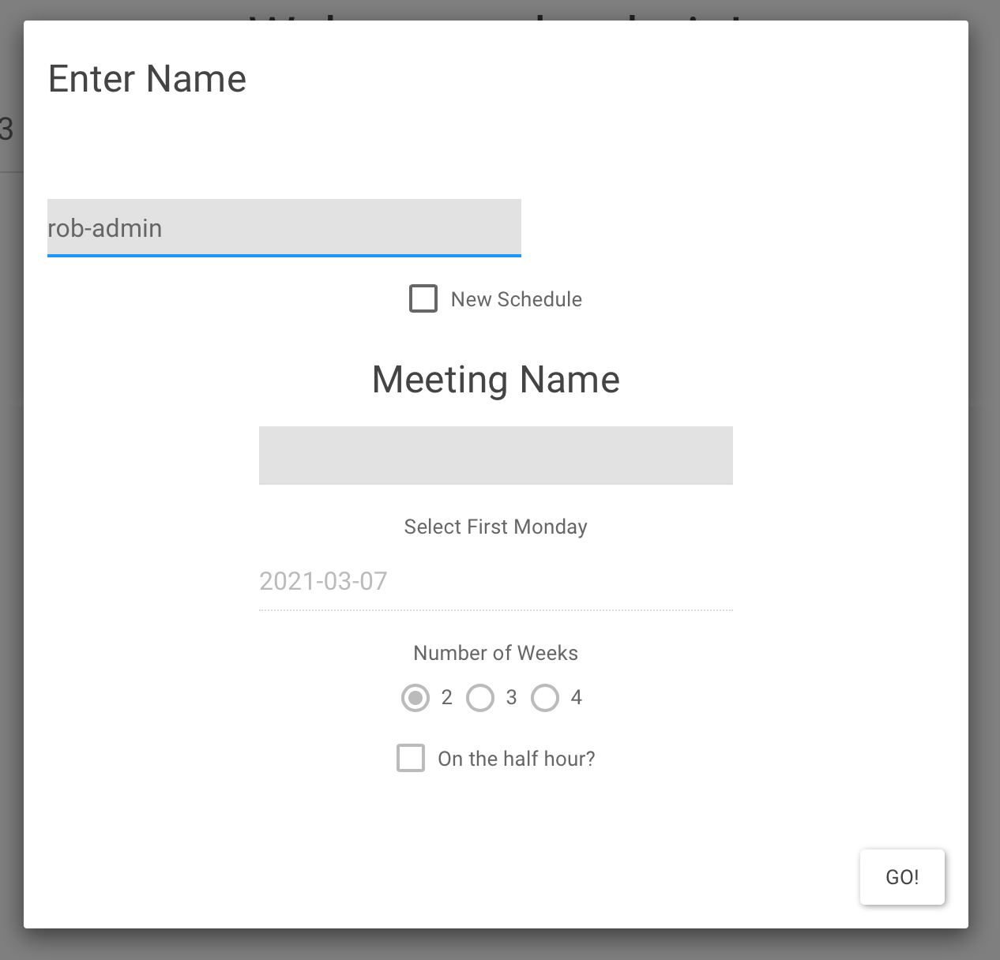
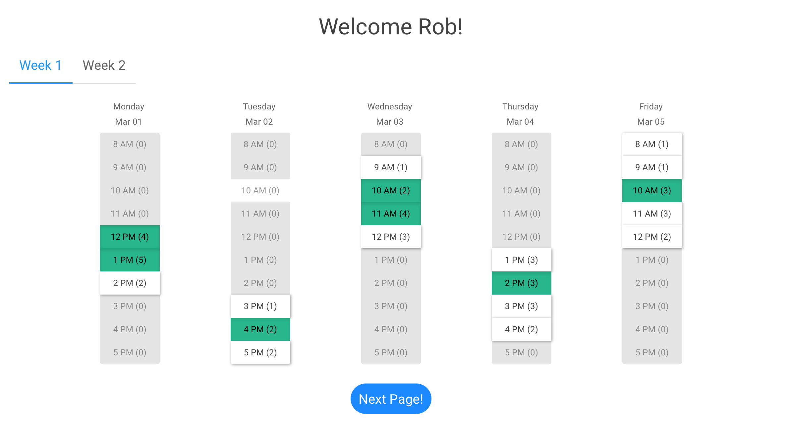
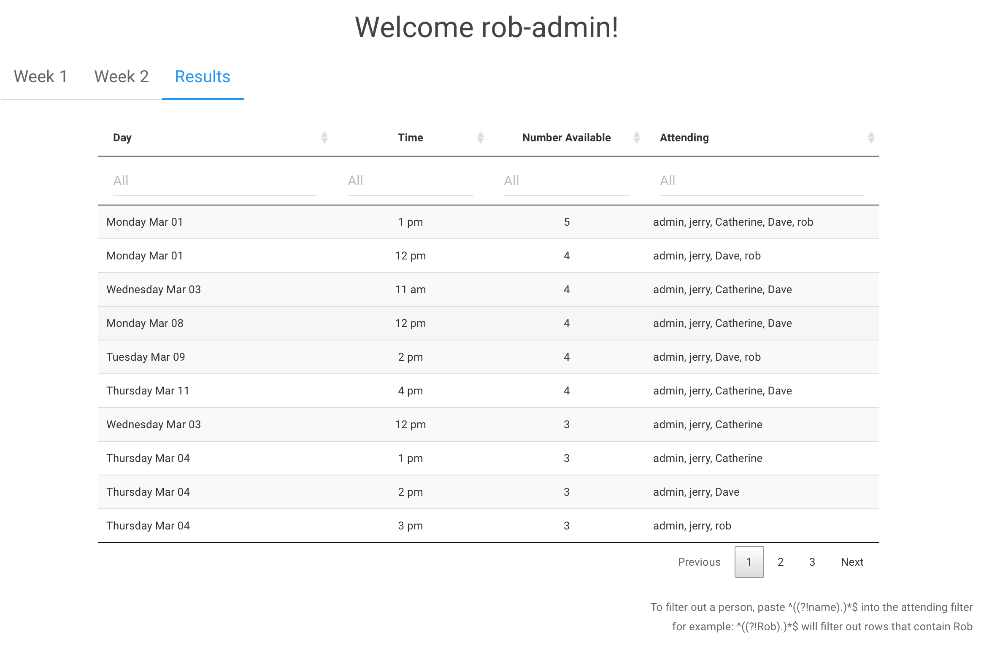

<!-- README.md is generated from README.Rmd. Please edit that file -->

# meetR

<!-- badges: start -->
<!-- badges: end -->

A minimalist shiny app for finding shared meeting times because I’m sick of
using doodle pools and all their ad garbage.

1.  Run the app locally after setting up google sheets (see link.R file
    for instructions)
2.  Publish your own version to shinyapps.io
3.  …profit?

How to use if you want to copy.
- Clone/fork/copy etc.
- Follow instructions in link.R file in www folder to setup google account. refer to googlesheets4 package
- This includes setting your admin name. I decided not use use username/password like in shinyAuth because it made everything too complicated. Just make a name for yourself that no one else in your network will use.
- Publish the app to shinyapps.io. Change the URL if you'd like it to be something other than an app ending in meetR. You might want to publish the app with a new URL everytime you use it (and archive/delete the app after) or simply just reuse the same url. 
- Use you admin name to "log in" and select the times you are available. 
- Hit "Done" so your data gets written to your google sheet
- "Log in" as someone else to confirm your choices were saved appropriately. 
- Send link out

Notes:
- Probably I haven't accounted for edge cases (people with same names etc.)
- There's very little in the way of insturcitons for anyone. I'm hoping the design is so intuitive it doesn't matter

Publish the app. Send link to the meeting people. They fill out the app.

After everyone responds, you see results and pick a time to meet. You
don’t deal with ads. Now you deal with a sluggish shiny app.

